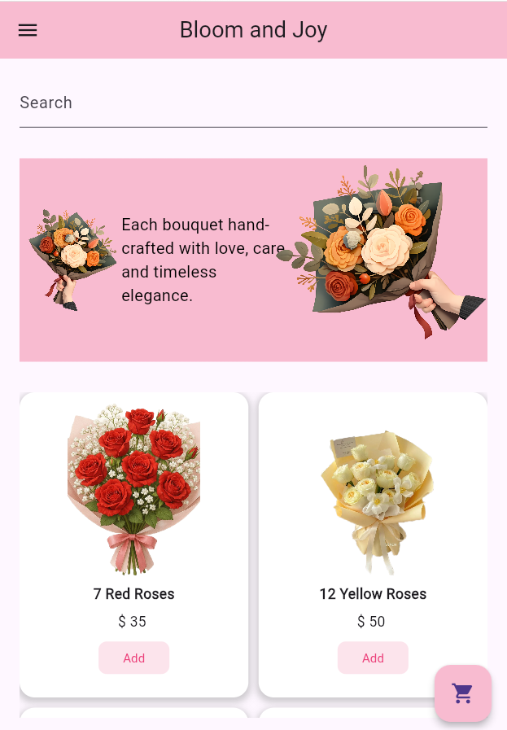
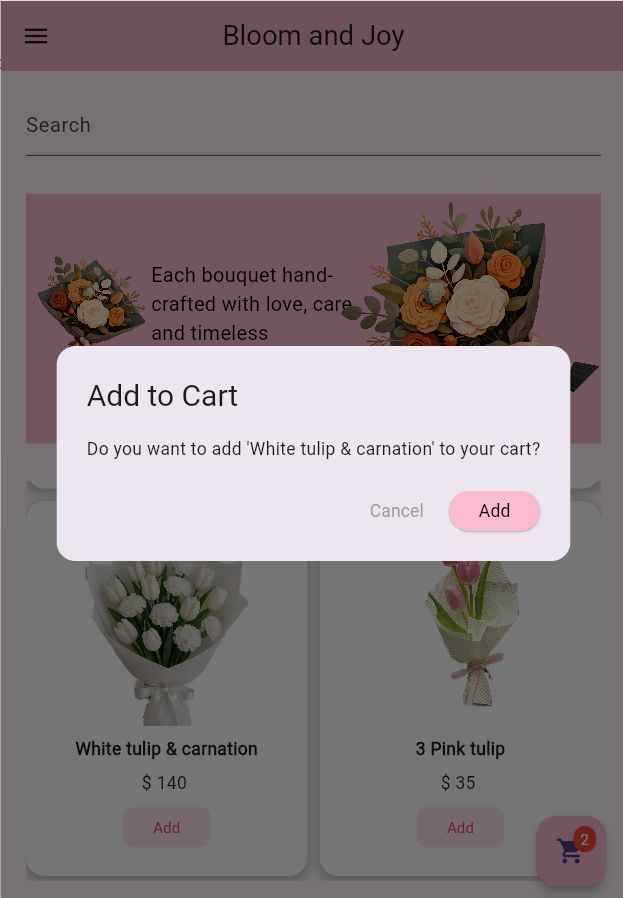
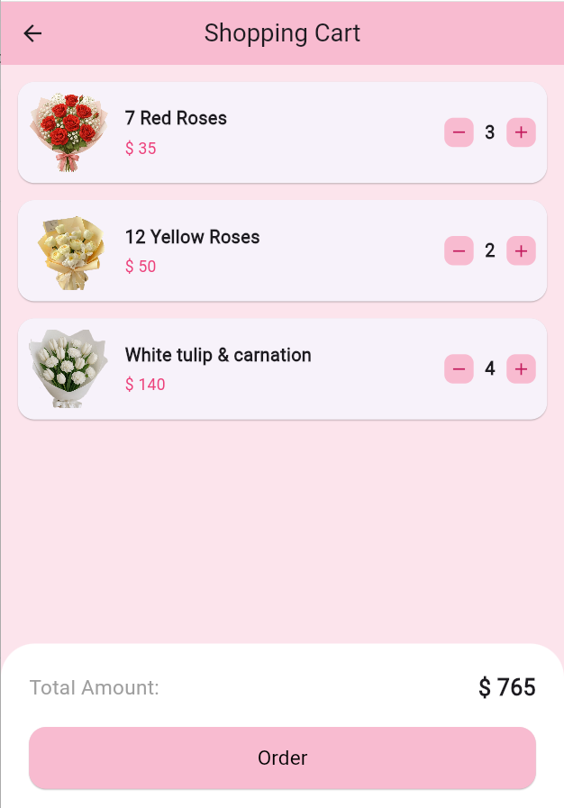

# 🌸 Bloom and Joy - Flower Shop App

A beautiful and lightweight Flutter application for browsing and ordering hand-crafted flower bouquets.

## 🚀 Key Features

- **Product Catalog**: View flower arrangements in a clean, responsive GridView.
- **Backend Integration**: Real-time data fetching from **Supabase**.
- **Shopping Cart**: Fully functional cart with the ability to add/remove items.
- **Quantity Management**: Increase or decrease item quantities directly in the cart.
- **Order Flow**: Automated cart clearing upon successful order placement.
- **Elegant UI**: Theme-based design focusing on a soft, aesthetic user experience.

## 🛠️ Tech Stack

- **Framework**: Flutter
- **Database**: Supabase
- **Language**: Dart
- **State Management**: StatefulWidget (setState)

## UI Screenshot

